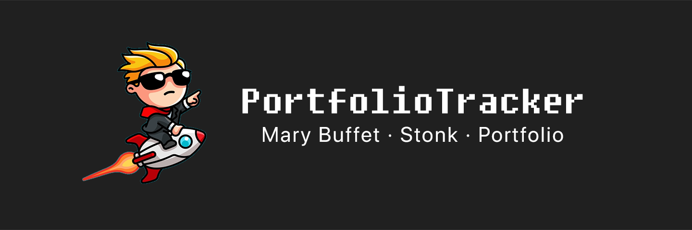

  

***
## Project Overview

The user inputs up to 5 stock tickers, and clicks download for the app to gather data from [Finnhub](https://finnhub.io) between *July 1 2021, 00:00:01 to Dec 31 2021, 23:59:59.*

The configuration of the emulator is as specified in the project requirements.

## Functionality

On running the application on Android Studio, the main screen consists of 5 text boxes on the left to input stock tickers, and the buttons on the right in each row are to indicate Download and Calculate respectively. Other than the basic functionalities in the requirements these are some additional ones

- Input validation for tickers, where an error popup shows up on the corresponding textbox where a ticker is invalid, or an empty string

- The calculate button will be inactive until the data for the ticker has been downloaded and persisted into the database.

- The user can input up to 5 tickers, and choose to click on 'DOWNLOAD ALL' to synchronously download data for each of the tickers. Clicking on 'CALCULATE ALL' will calculate and display the metrics for each ticker currently on the screen.

## Design Choices

We utilise the following 3 BroadcastReceivers:

- **MyBroadcastReceiver**

The main BroadcastReceiver for handling the calculate intent and initialising a Cursor to query the data for the ticker, followed by the calculation.

- **ErrorBroadcastReceiver**

As mentioned earlier, the app has the functionality to display an error when the ticker is invalid (i.e GOOGLE instead of GOOGL). This BroadcastReceiver enables the display of those errors.

- **DownloadBroadcastReceiver** 

This BroadcastReceiver enables the Calculate button once the intent is received after the completion of a download for the ticker.

/Users/omerwyo/Desktop/PortfolioTracker/app/build/intermediates/packaged_res/debug/drawable/header.png